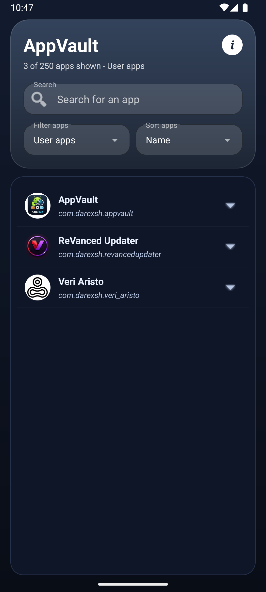
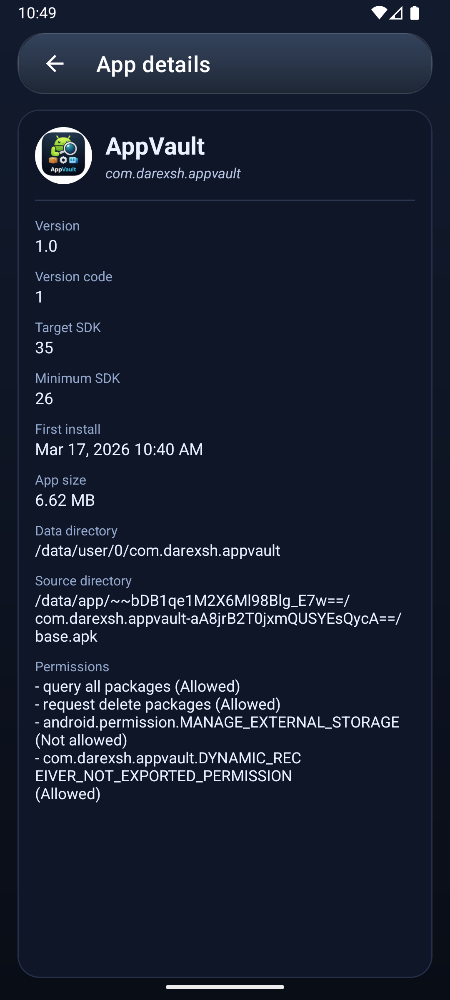
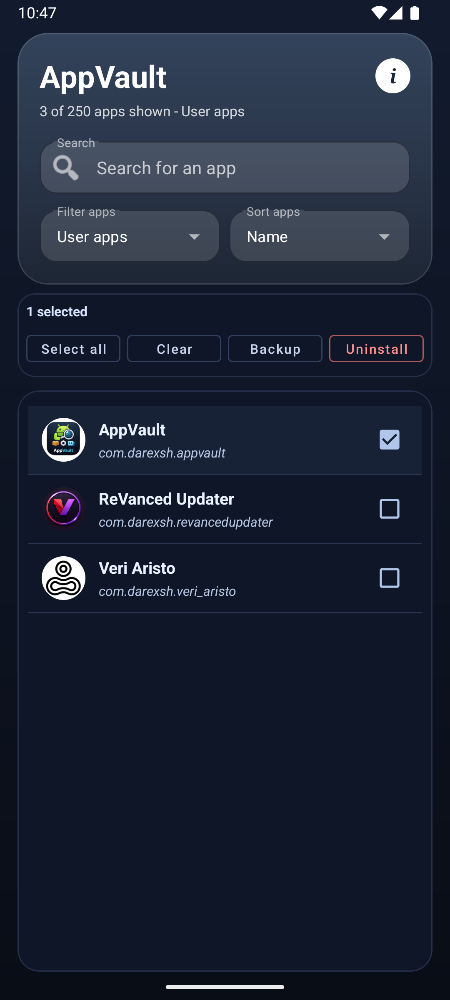
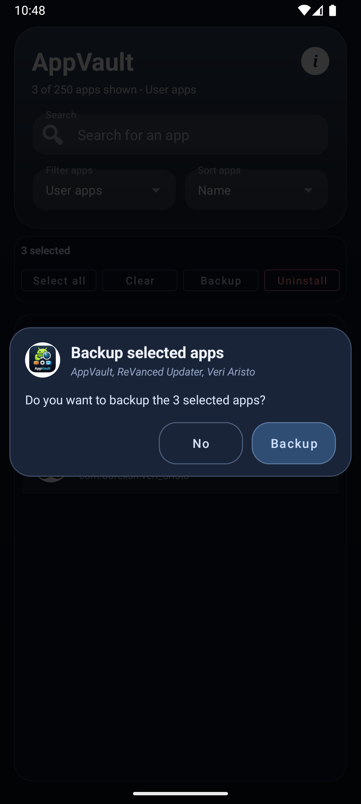
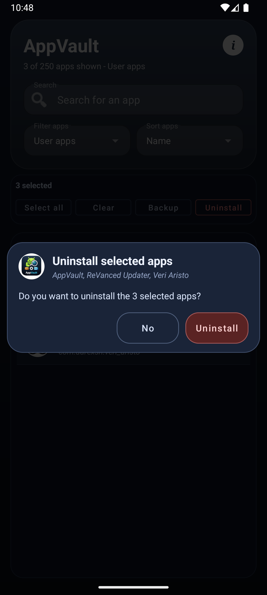
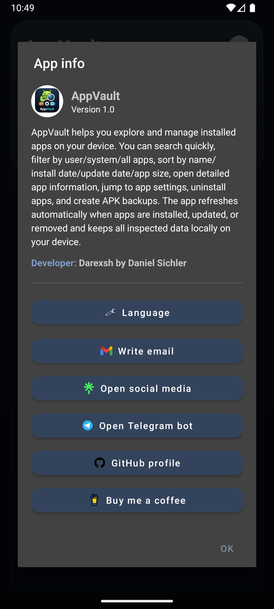

* * *

<div align="center">

📱 AppVault
============================

**An Android app for inspecting and managing installed applications**  
📦🔎⚙️💾🧭

  

[](https://t.me/darexsh_bot) [](https://buymeacoffee.com/darexsh)  
<sub>Get release updates on Telegram.<br>If you want to support more apps, you can leave a small donation for a coffee.</sub>

</div>


* * *

✨ Authors
---------

| Name | GitHub | Role | Contact | Contributions |
| --- | --- | --- | --- | --- |
| **[Darexsh by Daniel Sichler](https://github.com/Darexsh)** | [Link](https://github.com/Darexsh?tab=repositories) | Android App Development 📱🛠️, UI/UX Design 🎨 | 📧 [E-Mail](mailto:sichler.daniel@gmail.com) | Concept, Feature Implementation, App Inventory & Detail Logic, Backup/Uninstall Flows, UI Design |

* * *

🚀 About the Project
==============

**AppVault** is an Android application designed to help you inspect installed apps on your device. It provides a searchable app inventory, user/system filtering, sorting options, package-level details, backup actions, and quick access to app settings.

* * *

✨ Features
----------

* 🔎 **Search, Filter & Sort**: Search apps by name/package, filter by **User apps**, **System apps**, or **All apps**, and sort by **Name**, **Install date**, **Update date**, or **App size**.

* 📋 **App Inventory**: Clean list with app icon, app name, and package name.

* 🧾 **App Details Screen**: Open detailed metadata including version, version code, target SDK, min SDK, first install date, **app size**, data directory, source directory, and requested app permissions.

* ⚙️ **Quick App Actions**: Open system app settings, create APK backup, or uninstall from each app row.

* 💾 **APK Backup**: Save APK files into `/storage/emulated/0/App_Backups` (visible at root storage level like DCIM/Download).

* ✅ **Backup Confirm Dialog**: Friendly confirmation dialog before each backup operation.

* 🧩 **Selection Mode**: Long-press an app to enter selection mode, then run **backup** or **uninstall** for selected apps.

* 🪟 **Selected-App Confirm Dialogs**: Styled confirmation dialogs for selected-app backup/uninstall with selected app names shown.

* 🔄 **Live App List Refresh**: List updates automatically after installs, updates, and removals.

* 🔐 **Permissions Viewer**: Permissions are shown in a readable format with clear status labels (**Allowed** / **Not allowed**).

* 🌐 **Language Switcher**: Change app language from the App Info dialog using **System default**, **English**, or **Deutsch**.

* 🌙 **Dark Mode (Default)**: App uses a dark, no-action-bar UI by default.

* ℹ️ **In-App About Dialog**: Includes version, description, and social/contact buttons.


* * *

📸 Screenshots
--------------

<table>
  <tr>
    <td align="center"><b>Home Screen</b><br></td>
    <td align="center"><b>Details</b><br></td>
    <td align="center"><b>Selection Mode</b><br></td>
  </tr>
</table>

<table>
  <tr>
    <td align="center"><b>Backup Dialog</b><br></td>
    <td align="center"><b>Uninstall Dialog</b><br></td>
    <td align="center"><b>About</b><br></td>
  </tr>
</table>

* * *

📥 Installation
---------------

1. **Build from source**:

    * Clone or download the repository from GitHub:

        ```bash
        git clone https://github.com/Darexsh/AppVault.git
        ```

    * Open the project in **Android Studio**.

    * Sync Gradle and build the project.

    * Run the app on an Android device or emulator (Android 8+ recommended).

2. **Install via APK release**:

    * Download the APK from the GitHub Releases page.

    * 🔒 Enable installation from unknown sources if prompted (required on Android 8+).

    * 📂 Open the APK on your device and follow the installation steps.


* * *

📝 Usage
--------

1. **Browse Apps**:

    * Open the app to view installed applications.

    * Use search, filter, and sort controls in the header.

2. **Inspect Details**:

    * Tap an app row to open its details screen.

3. **Single App Actions**:

    * Tap the row action arrow to expand actions.

    * Use **App settings**, **Backup**, or **Uninstall**.

4. **Selection Mode**:

    * Long-press an app to enter selection mode.

    * Select multiple apps and run **Backup** or **Uninstall** from the action bar.

    * Review selected app names in the confirmation dialog before continuing.

5. **Grant File Access for Backups**:

    * If needed, accept the in-app prompt and allow file access in Android settings.

6. **Change App Language**:

    * Open the App Info dialog (`i` button in header).

    * Tap **Language** and choose **English** or **Deutsch**.


* * *

🔑 Permissions
--------------

* 📦 **Query Installed Apps** (`QUERY_ALL_PACKAGES`): Required to list installed apps.

* 💾 **File Access** (`MANAGE_EXTERNAL_STORAGE` on Android 11+): Required to save APK backups into `App_Backups` root folder.

* 🗑️ **Delete Packages** (`REQUEST_DELETE_PACKAGES`): Required to trigger uninstall requests.


* * *

⚙️ Technical Details
--------------------

* 📦 Built with **Java** and Android SDK components.

* 📱 Uses `PackageManager` to enumerate installed apps and collect metadata.

* 🔄 Uses `BroadcastReceiver` package events (`ADDED/REMOVED/CHANGED/REPLACED`) for live list refresh.

* 💾 APK backup copies from installed APK source files to external storage (`App_Backups`), including split APK parts when available.

* ⚠️ Split-APK restore note: split backups may require split-aware installation; tapping a single APK file in a file manager may not install split apps.

* 🧭 Navigation includes a dedicated app-details activity.

* 📏 Details page app size is shown as installed APK footprint (base + split APK files when present).

* 🔐 Permission details are read from package metadata and displayed as friendly names with grant state.

* 🌐 Language behavior: **System default** is the default mode. If the system language is not supported, the app falls back to English.

* 🎨 UI built with Material Components and custom dialogs/themes.


* * *

📜 License
----------

This project is licensed under the **Non-Commercial Software License (MIT-style) v1.0** and was developed as an educational project. You are free to use, modify, and distribute the code for **non-commercial purposes only**, and must credit the author:

**Copyright (c) 2025 Darexsh by Daniel Sichler**

Please include the following notice with any use or distribution:

> Developed by Daniel Sichler aka Darexsh. Licensed under the Non-Commercial Software License (MIT-style) v1.0. See `LICENSE` for details.

The full license is available in the [LICENSE](LICENSE) file.

* * *

<div align="center"> <sub>Created with ❤️ by Daniel Sichler</sub> </div>
